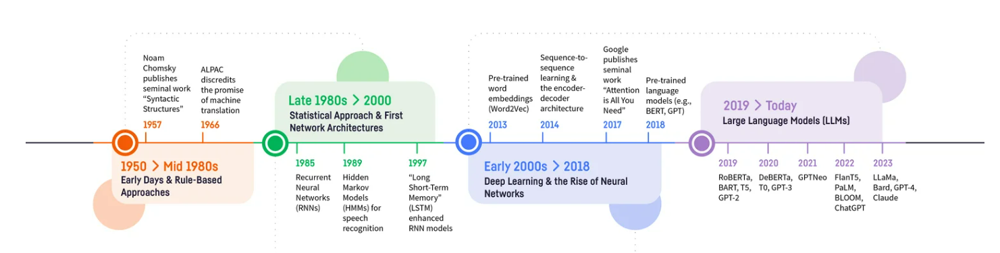
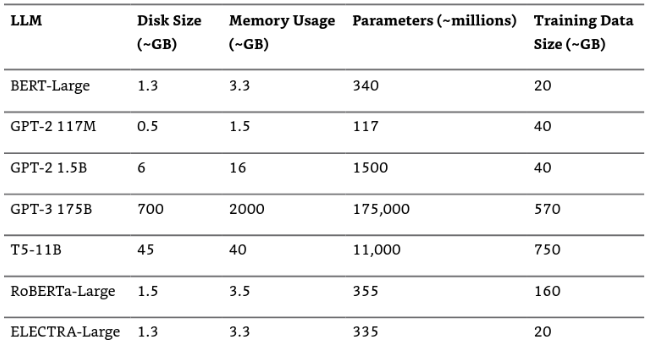
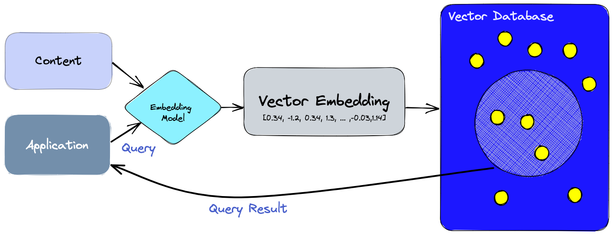
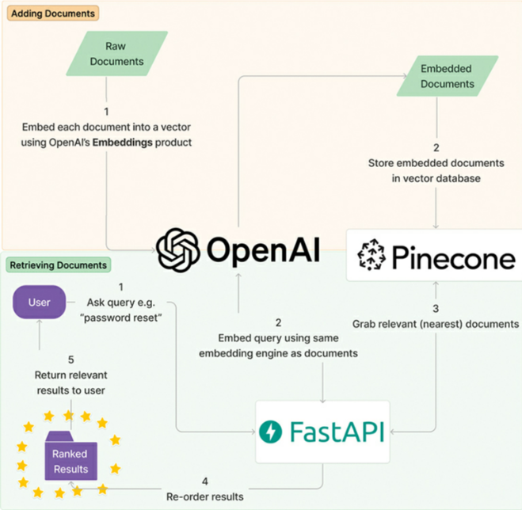
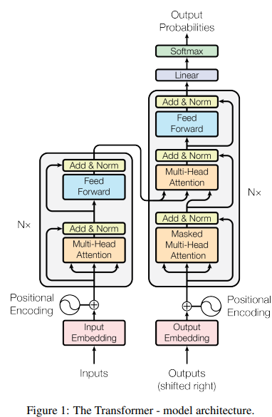
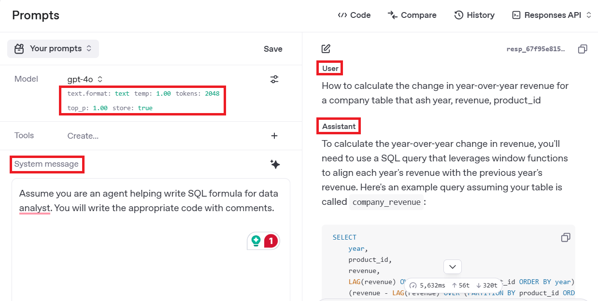

<a href="https://www.rksmusings.com/2023/10/29/quick-start-guide-to-large-language-models/" target="_blank">Quick LLM Guide</a>



## Q.1. What are Language Models?
Language models are artificial intelligence systems that can understand, interpret, and generate human language. The foundation of modern language models is the Transformer architecture, introduced in the seminal paper "Attention is All You Need" (Vaswani et al., 2017). This architecture revolutionized natural language processing by using attention mechanisms rather than recurrent neural networks.

## Types of Language Models
There are two primary types of language models:

1. **Autoregressive Models (NLG)**: These models predict the next token based on previous context only.
   * Examples: GPT family, LLaMA
   * Characteristics: Forward predictive, good at text generation
   * Use case: Content creation, chatbots, summarization

2. **Autoencoding Models (NLU)**: These models have access to context on both sides (past and future tokens).
   * Examples: BERT family
   * Characteristics: Bidirectional context, better at understanding relationships
   * Use case: Classification, sentiment analysis, information extraction

3. **Hybrid Models**: Some models combine both approaches.
   * Example: T5 (Text-to-Text Transfer Transformer)
   * Characteristics: Can both encode and generate text

## Large Language Models (LLMs)
Models with roughly 100 million parameters or more are typically considered LLMs. These include:

* **GPT series** (OpenAI): GPT-4, GPT-4o
* **Claude** (Anthropic)
* **LLaMA** (Meta)
* **BERT variants** (Google)
* **T5 models** (Google)

  

## Performance Characteristics
* **Autoregressive models** (like GPT): Slower processing but powerful text generation capabilities
* **Autoencoding models** (like BERT): Faster at encoding semantic meaning but limited generation abilities

## Applications of LLMs
1. **Text Encoding**: Converting text into semantic vectors for information retrieval
   * Example: Using BERT embeddings to create searchable document databases

2. **Transfer Learning**: Fine-tuning pre-trained models for specific tasks
   * Example: Fine-tuning BERT for sentiment classification in customer reviews

3. **Prompt-Based Task Solving**: Leveraging pre-trained capabilities through prompting
   * Example: Prompting T5 to perform language translation

4. **Content Generation**: Creating human-quality text content
   * Example: Using GPT models to draft emails or articles

Many LLMs are available as APIs, such as OpenAI's GPT models, which can be accessed through their [playground](https://platform.openai.com/playground/prompts?models=gpt-4o).

## Q.2. What is Semantic Search?

Semantic search is a system that understands the meaning and context of a search query and matches it against the meaning and context of available documents for retrieval. Unlike traditional keyword-based search, semantic search can find relevant results without having to rely on exact keyword or n-gram matching, often using a pre-trained large language model (LLM) to understand the nuances of the query and the documents.





The core process involves encoding or embedding both search queries and documents into vectors using the same embedding method through language models. The semantic search engine then finds the closest matches by measuring distances between these vectors using metrics like:

- Euclidean distance
- Cosine similarity
- Dot product

The embedded documents are typically stored in specialized vector databases, including:

- FAISS (Facebook AI Similarity Search)
- ChromaDB
- Pinecone
- Weaviate
- Milvus
- Qdrant

## Types of Semantic Search

There are two primary types of semantic search:

1. **Asymmetric Search**: This is the most common scenario, where the query and document formats differ significantly. For example, matching a short user query on eBay with paragraph-length item descriptions.

2. **Symmetric Search**: When both the query and target documents have similar structures. For example, matching a Google search query with website titles.

## Vector Embeddings (Dense Representations)

Vector embeddings are also called dense representations. They provide a way to represent words or phrases as machine-readable numerical vectors in a multi-dimensional space, typically based on their contextual meaning. The principle is that similar phrases (in terms of semantic meaning) will have vectors that are close together by some measure (like Euclidean distance) and vice-versa.

Off-the-shelf closed-source embedding models like OpenAI's text-embedding-ada-002 from the GPT-3 family have a fixed context window (input size) and embedding (output) size. These constraints must be worked around in practical applications.

## Language Models for Encoding

Two subsets of language models are commonly used for encoding:

1. **Cross-Encoder**: Takes pairs of input sequences and predicts a score (not an embedding) indicating the relevance of the second sequence to the first. Cross-encoders are often used for re-ranking search results to improve precision after an initial retrieval phase.

2. **Bi-Encoder**: Creates batches of text embeddings to be stored and used in information retrieval tasks like search. Bi-encoders process query and document independently, making them more efficient for large-scale retrieval.

## Chunking Strategies

Since embedding models have fixed token windows, chunking is used to turn larger documents into smaller pieces:

1. **Natural Breaks Chunking**: Dividing text at natural boundaries like page breaks, paragraphs, or sections
2. **Fixed-Size Chunking**: Breaking text into chunks of consistent token lengths
3. **Semantic Chunking**: Creating chunks based on topic coherence using clustering algorithms
4. **Sliding Window Chunking**: Creating overlapping chunks to maintain context between adjacent text segments
5. **Recursive Chunking**: Creating hierarchical representations of documents


## Q.3. What are Transformers?
Transformers are neural network architectures introduced in the paper <a href="https://arxiv.org/abs/1706.03762" target="_blank">Attention is All You Need (2017)</a>
that revolutionized natural language processing.



## Three Main Components
1. **Word Embedding** - Vector representation of tokens (words)
2. **Positional Encoding** - Maintains word order information
   - Example: "Squatch eats Pizza" → Bam! vs "Pizza eats squatch" → Yikes
3. **Attention (Q, K, V)** - Establishes relationships among words

## Attention Mechanism
The attention mechanism helps the model correctly associate words with their references:
- Example: "The pizza came out of the oven and it tasted good"
  - The word "it" could refer to either pizza or oven
  - Attention helps determine "it" refers to "pizza"

## Types of Attention

### Self-Attention
- Calculates similarity between a word and all other words in a sentence (including itself)
- Formula: Attention(Q, K, V) = SoftMax(QKᵀ/√dₖ)V
  - Q = Query, K = Key, V = Value, where dₖ is dimension of key matrix
  - **Normalization by √dₖ**: This scaling prevents extremely large dot products that would push softmax into regions with tiny gradients, stabilizes training, and prevents attention from focusing too narrowly on single positions
  - SoftMax transformation ensures each row sums to 1
  - The probability of similarity between Q and Keys multiplies the Value matrix
  - Results determine how much weight each word has in the final encoding

### Masked Self-Attention
- Used in decoder-only transformers (like ChatGPT)
- Starts with word embedding and positional encoding
- Ignores words that come after the word of interest
- Used to train models to generate responses to prompts
- Creates generative responses

### Encoder-Decoder Attention
- First model built for tasks like language translation (Seq2Seq)
- Uses both encoder and decoder transformers
- Also called cross-attention

### Multi-Head Attention
- Helps establish relationships in longer, complex sentences
- Applies attention to encoded values multiple times simultaneously
- Each attention unit is called a "head" with its own weights for Q, K, and V
- The original paper used 8 attention heads

## Transformer Types
- **Encoder-only transformer**: Creates context-aware embeddings
- **Decoder-only transformer**: Used for text generation (like ChatGPT)
- **Encoder-Decoder transformer**: Used for translation tasks

## Q.4. What is Prompt Engineering?

Prompt engineering is the process of carefully designing inputs for massively large language models such as GPT-3 and ChatGPT to guide them to produce relevant and coherent outputs. Many AI researchers consider prompt engineering a "bug" in AI and that it will go away in the next few years.

Remember attention and how LLMs predict? They predict one token/word at a time. That means that order matters - put your instruct FIRST and context SECOND so that when the LLM reads the context, it has already read the instruction and is thinking about the task the whole time. 

The three main parameters you can tune in OpenAI's GPT playground are:

1. **Temperature** (0-2): Controls randomness in token selection
   - **Formula**: $P(\text{token}_i) = \frac{\exp(\text{logit}_i / T)}{\sum_j \exp(\text{logit}_j / T)}$
   - **Low values** (0-0.3): More deterministic, consistent outputs
   - **High values** (0.7-2.0): More creative, diverse, potentially surprising outputs
   - **Default**: 1.0 (standard probability distribution)

2. **Maximum Token Length** (1-4096+): Limits response size
   - Controls how many tokens (roughly 4 characters or ¾ of a word) the model will generate
   - Higher values allow for longer responses but consume more resources
   - Models have different maximum context limits (e.g., GPT-4 supports 8K-32K tokens)

3. **Top-p** (0-1): Controls token diversity via nucleus sampling
   - Only considers tokens whose cumulative probability exceeds the specified value
   - **Lower values** (e.g., 0.5): More focused on highly probable tokens
   - **Higher values** (e.g., 0.9): Considers a wider range of possible tokens
   - **Value of 1.0**: Considers all possible next tokens (no filtering)
  



## Few-Shot Learning/In-Context Learning

Another interesting way to prompt our LLM is few-shot learning/In-context learning. In this we give an LLM an example of task being solved to teach the LLM how to reason through a problem and also to format the answer in desired format.

GPT-3 papers' title called out few-shot learning as a primary source of in-context learning - on the job training for an LLM. (Language Models are Few Shot Learners)

### Example: Movie Review Classification
```
Classify the following movie reviews as positive or negative:
Review: "This film was absolutely brilliant! The acting was superb."
Classification: Positive
Review: "Terrible plot, wooden acting, and poor direction."
Classification: Negative
Review: "I couldn't stop checking my watch. Complete waste of time."
Classification:
```
Few shot prompting can become cumbersome if we are doing a classification task with 1000s of labels, as we'd need examples of those for the model to learn via few-shot.
