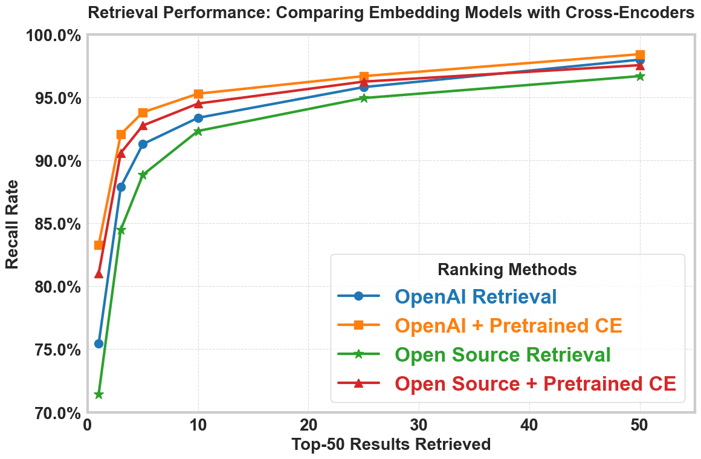
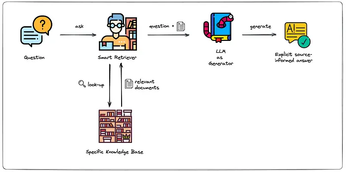
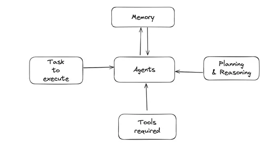
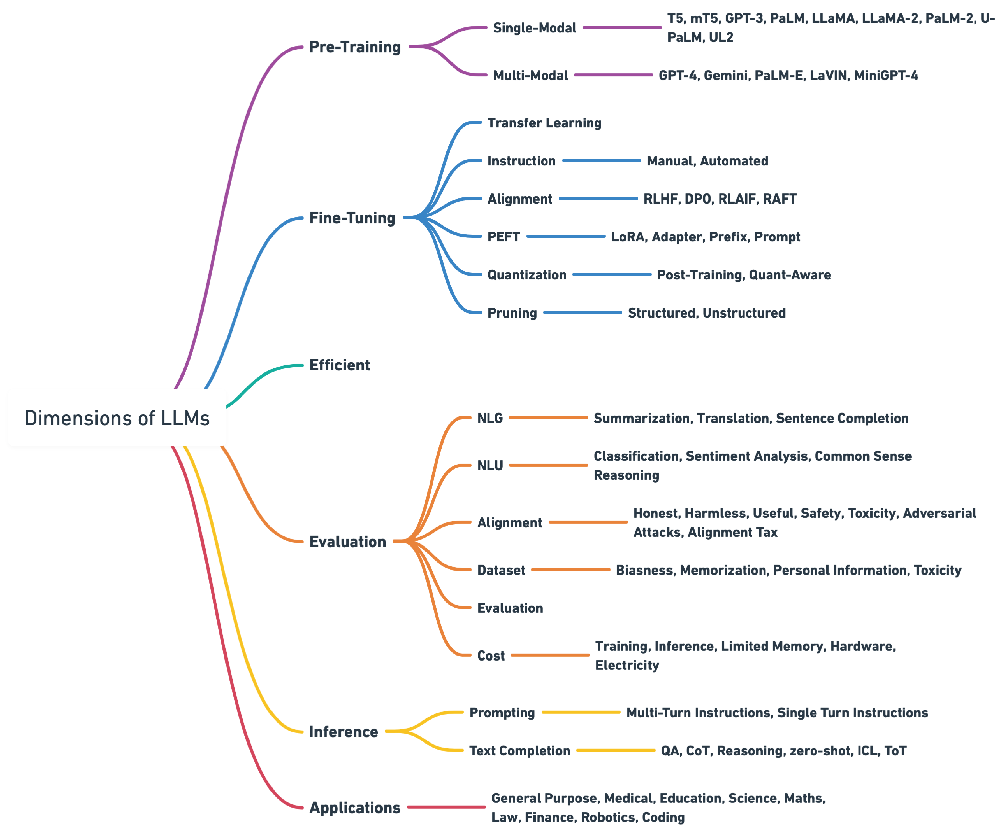

<a href="https://www.rksmusings.com/2023/10/29/quick-start-guide-to-large-language-models/" target="_blank">Quick LLM Guide</a>


## Q.1. What are Language Models?
Language models are artificial intelligence systems that can understand, interpret, and generate human language. The foundation of modern language models is the Transformer architecture, introduced in the seminal paper "Attention is All You Need" (Vaswani et al., 2017). This architecture revolutionized natural language processing by using attention mechanisms rather than recurrent neural networks.

## Types of Language Models
There are two primary types of language models:

1. **Autoregressive Models (NLG)**: These models predict the next token based on previous context only.
   * Examples: GPT family, LLaMA
   * Characteristics: Forward predictive, good at text generation
   * Use case: Content creation, chatbots, summarization

2. **Autoencoding Models (NLU)**: These models have access to context on both sides (past and future tokens).
   * Examples: BERT family
   * Characteristics: Bidirectional context, better at understanding relationships
   * Use case: Classification, sentiment analysis, information extraction

3. **Hybrid Models**: Some models combine both approaches.
   * Example: T5 (Text-to-Text Transfer Transformer)
   * Characteristics: Can both encode and generate text

## Large Language Models (LLMs)
Models with roughly 100 million parameters or more are typically considered LLMs. These include:

* **GPT series** (OpenAI): GPT-4, GPT-4o
* **Claude** (Anthropic)
* **LLaMA** (Meta)
* **BERT variants** (Google)
* **T5 models** (Google)

  

## Performance Characteristics
* **Autoregressive models** (like GPT): Slower processing but powerful text generation capabilities
* **Autoencoding models** (like BERT): Faster at encoding semantic meaning but limited generation abilities

## Applications of LLMs
1. **Text Encoding**: Converting text into semantic vectors for information retrieval
   * Example: Using BERT embeddings to create searchable document databases

2. **Transfer Learning**: Fine-tuning pre-trained models for specific tasks
   * Example: Fine-tuning BERT for sentiment classification in customer reviews

3. **Prompt-Based Task Solving**: Leveraging pre-trained capabilities through prompting
   * Example: Prompting T5 to perform language translation

4. **Content Generation**: Creating human-quality text content
   * Example: Using GPT models to draft emails or articles

Many LLMs are available as APIs, such as OpenAI's GPT models, which can be accessed through their [playground](https://platform.openai.com/playground/prompts?models=gpt-4o).

## Q.2. What is Semantic Search?

Semantic search is a system that understands the meaning and context of a search query and matches it against the meaning and context of available documents for retrieval. Unlike traditional keyword-based search, semantic search can find relevant results without having to rely on exact keyword or n-gram matching, often using a pre-trained large language model (LLM) to understand the nuances of the query and the documents.


The core process involves encoding or embedding both search queries and documents into vectors using the same embedding method through language models. The semantic search engine then finds the closest matches by measuring distances between these vectors using metrics like:

- Euclidean distance
- Cosine similarity
- Dot product

The embedded documents are typically stored in specialized vector databases, including:

- FAISS (Facebook AI Similarity Search)
- ChromaDB
- Pinecone
- Weaviate
- Milvus
- Qdrant

## Types of Semantic Search

There are two primary types of semantic search:

1. **Asymmetric Search**: This is the most common scenario, where the query and document formats differ significantly. For example, matching a short user query on eBay with paragraph-length item descriptions.

2. **Symmetric Search**: When both the query and target documents have similar structures. For example, matching a Google search query with website titles.

## Vector Embeddings (Dense Representations)

Vector embeddings are also called dense representations. They provide a way to represent words or phrases as machine-readable numerical vectors in a multi-dimensional space, typically based on their contextual meaning. The principle is that similar phrases (in terms of semantic meaning) will have vectors that are close together by some measure (like Euclidean distance) and vice-versa.

Off-the-shelf closed-source embedding models like OpenAI's text-embedding-ada-002 from the GPT-3 family have a fixed context window (input size) and embedding (output) size. These constraints must be worked around in practical applications.

## Language Models for Encoding

Two subsets of language models are commonly used for encoding:

1. **Cross-Encoder**: Takes pairs of input sequences and predicts a score (not an embedding) indicating the relevance of the second sequence to the first. Cross-encoders are often used for re-ranking search results to improve precision after an initial retrieval phase.

2. **Bi-Encoder**: Creates batches of text embeddings to be stored and used in information retrieval tasks like search. Bi-encoders process query and document independently, making them more efficient for large-scale retrieval.

## Chunking Strategies

Since embedding models have fixed token windows, chunking is used to turn larger documents into smaller pieces:

1. **Natural Breaks Chunking**: Dividing text at natural boundaries like page breaks, paragraphs, or sections
2. **Fixed-Size Chunking**: Breaking text into chunks of consistent token lengths
3. **Semantic Chunking**: Creating chunks based on topic coherence using clustering algorithms
4. **Sliding Window Chunking**: Creating overlapping chunks to maintain context between adjacent text segments
5. **Recursive Chunking**: Creating hierarchical representations of documents



## Q.3. What are Transformers?
Transformers are neural network architectures introduced in the paper <a href="https://arxiv.org/abs/1706.03762" target="_blank">Attention is All You Need (2017)</a>
that revolutionized natural language processing.


## Three Main Components
1. **Word Embedding** - Vector representation of tokens (words)
2. **Positional Encoding** - Maintains word order information
   - Example: "Squatch eats Pizza" → Bam! vs "Pizza eats squatch" → Yikes
3. **Attention (Q, K, V)** - Establishes relationships among words

## Attention Mechanism
The attention mechanism helps the model correctly associate words with their references:
- Example: "The pizza came out of the oven and it tasted good"
  - The word "it" could refer to either pizza or oven
  - Attention helps determine "it" refers to "pizza"

## Types of Attention

### Self-Attention
- Calculates similarity between a word and all other words in a sentence (including itself)
- Formula: Attention(Q, K, V) = SoftMax(QKᵀ/√dₖ)V
  - Q = Query, K = Key, V = Value, where dₖ is dimension of key matrix
  - **Normalization by √dₖ**: This scaling prevents extremely large dot products that would push softmax into regions with tiny gradients, stabilizes training, and prevents attention from focusing too narrowly on single positions
  - SoftMax transformation ensures each row sums to 1
  - The probability of similarity between Q and Keys multiplies the Value matrix
  - Results determine how much weight each word has in the final encoding

### Masked Self-Attention
- Used in decoder-only transformers (like ChatGPT)
- Starts with word embedding and positional encoding
- Ignores words that come after the word of interest
- Used to train models to generate responses to prompts
- Creates generative responses

### Encoder-Decoder Attention
- First model built for tasks like language translation (Seq2Seq)
- Uses both encoder and decoder transformers
- Also called cross-attention

### Multi-Head Attention
- Helps establish relationships in longer, complex sentences
- Applies attention to encoded values multiple times simultaneously
- Each attention unit is called a "head" with its own weights for Q, K, and V
- The original paper used 8 attention heads

## Transformer Types
- **Encoder-only transformer**: Creates context-aware embeddings
- **Decoder-only transformer**: Used for text generation (like ChatGPT)
- **Encoder-Decoder transformer**: Used for translation tasks

## Q.4. What is Prompt Engineering?

Prompt engineering is the process of carefully designing inputs for massively large language models such as GPT-3 and ChatGPT to guide them to produce relevant and coherent outputs. Many AI researchers consider prompt engineering a "bug" in AI and that it will go away in the next few years.

Remember attention and how LLMs predict? They predict one token/word at a time. That means that order matters - put your instruct FIRST and context SECOND so that when the LLM reads the context, it has already read the instruction and is thinking about the task the whole time. 

The three main parameters you can tune in OpenAI's GPT playground are:

1. **Temperature** (0-2): Controls randomness in token selection
   - **Formula**: $P(\text{token}_i) = \frac{\exp(\text{logit}_i / T)}{\sum_j \exp(\text{logit}_j / T)}$
   - **Low values** (0-0.3): More deterministic, consistent outputs
   - **High values** (0.7-2.0): More creative, diverse, potentially surprising outputs
   - **Default**: 1.0 (standard probability distribution)

2. **Maximum Token Length** (1-4096+): Limits response size
   - Controls how many tokens (roughly 4 characters or ¾ of a word) the model will generate
   - Higher values allow for longer responses but consume more resources
   - Models have different maximum context limits (e.g., GPT-4 supports 8K-32K tokens)

3. **Top-p** (0-1): Controls token diversity via nucleus sampling
   - Only considers tokens whose cumulative probability exceeds the specified value
   - **Lower values** (e.g., 0.5): More focused on highly probable tokens
   - **Higher values** (e.g., 0.9): Considers a wider range of possible tokens
   - **Value of 1.0**: Considers all possible next tokens (no filtering)
  


## Few-Shot Learning/In-Context Learning

Another interesting way to prompt our LLM is few-shot learning/In-context learning. In this we give an LLM an example of task being solved to teach the LLM how to reason through a problem and also to format the answer in desired format.

GPT-3 papers' title called out few-shot learning as a primary source of in-context learning - on the job training for an LLM. 

Reference: <a href="https://arxiv.org/abs/2005.14165" target="_blank">Language Models are Few Shot Learners</a>

### Example: Movie Review Classification
```
Classify the following movie reviews as positive or negative:
Review: "This film was absolutely brilliant! The acting was superb."
Classification: Positive
Review: "Terrible plot, wooden acting, and poor direction."
Classification: Negative
Review: "I couldn't stop checking my watch. Complete waste of time."
Classification:
```
Few shot prompting can become cumbersome if we are doing a classification task with 1000s of labels, as we'd need examples of those for the model to learn via few-shot.

## Q.5. What is RAG?

RAG stands for Retrieval-Augmented Generation. It's an approach that enhances large language models by retrieving relevant information from external sources before generating responses.

A RAG system typically consists of three main components:

1. **Indexer**: Converts raw text data into vector embeddings and stores them in a database
2. **Retriever**: Fetches the most relevant information from the database based on the user's query
3. **Generator**: An LLM (like GPT-4) that uses both the user's query and the retrieved information to create a coherent, informed response



## RAG Prompt Template

Good prompting techniques improve RAG system performance by providing clearer instructions to the LLM about how to use retrieved information. As shown in the examples, a well-structured prompt helps the model determine when information is sufficient and how to respond appropriately.

Effective prompting essentially teaches the model the right decision-making process for incorporating retrieved information, which leads to more accurate, helpful, and trustworthy responses.
```
[START]
User Input: Who is the Gabonese president?
Context: Ali Bongo Ondimba (born Alain Bernard Bongo; 9 February 1959), sometimes known as Ali Bongo, is a Gabonese politician who has been President of Gabon since October 2009.
Context Score: 0.653874516
Assistant Thought: This context has sufficient information to answer the question.
Assistant Response: The Gabonese president is Ali Bongo Ondimba, who has been in office since October 2009.
[END]
[START]
User Input: How old is Obama
Context: Ali Bongo Ondimba (born Alain Bernard Bongo; 9 February 1959), sometimes known as Ali Bongo, is a Gabonese politician who has been President of Gabon since October 2009.
Context Score: 0.275272697
Assistant Thought: This context does not have sufficient information to answer the question.
Assistant Response: I don't have sufficient information to answer how old Obama is based on the provided context.
[END]
```

## Evaluating RAG Systems

### Evaluating the Retriever

When evaluating a RAG retriever, metrics like precision and recall are commonly used:

- **Precision** = # of relevant documents / # of documents retrieved
- **Recall** = # of relevant documents retrieved / # of all relevant documents

The choice between precision and recall depends on your task:
- If multiple relevant documents exist, precision might be a better metric
- If you typically have one relevant document at a time, recall might be more appropriate

### Evaluating the Generator

For the generator component, the evaluation focuses on:
- Whether it correctly admits when it cannot answer a question due to insufficient context
- If it answers inline with the provided context
- Whether it provides factual information

This generally involves creating a rubric with questions like:
- Did the AI answer the question?
- Was the response conversational and natural?
- Did it provide a source?
- Was the information accurate and factual?

The evaluator can be human or another AI system following the rubric.

### Evaluating Indexing

We can also evaluate a RAG's indexing capability by checking whether two pieces of text that should be similar are embedded close to each other. If not, fine-tuning the embedding model might be necessary.

## Q.6. What are AI Agents and Workflows?
[Agents and Workflows Reading](https://langchain-ai.github.io/langgraph/tutorials/workflows/#agent)

## AI Agents

An AI agent is a type of artificial intelligence system that can perceive its environment, make decisions, and take actions to achieve specific goals. The key characteristic that distinguishes AI agents from more basic AI systems is their ability to use tools, perform actions based on those tools, observe the results, and respond accordingly.

AI agents follow a "thought, action, observation, and response" pattern, where they:
1. Process information and decide what to do
2. Take an action using available tools
3. Observe the results of that action
4. Respond based on those observations

Agents are systems where LLMs dynamically direct their own processes and tool usage, maintaining control over how they accomplish tasks. They're best suited for open-ended problems where it's difficult to predict the required number of steps and where you can't hardcode a fixed path.



## Workflows

Workflows are systems where LLMs and tools are orchestrated through predefined code paths. Unlike agents, workflows follow fixed patterns designed by developers rather than allowing the AI to dynamically determine its own process.

The document identifies several types of workflows:

1. **Prompt Chaining**: Decomposes tasks into sequential steps, with each LLM call processing the output of the previous one.

2. **Parallelization**: LLMs work simultaneously on tasks, either by breaking them into independent subtasks or running the same task multiple times.

3. **Routing**: Classifies inputs and directs them to specialized followup tasks.

4. **Orchestrator-Worker**: A central LLM dynamically breaks down tasks, delegates to worker LLMs, and synthesizes results.

5. **Evaluator-Optimizer**: One LLM generates a response while another provides evaluation and feedback in a loop.

## Combining Agents and Workflows

AI agents and workflows can be combined to create powerful systems that leverage the strengths of both approaches. For example, in a comprehensive travel planning system:

- A master AI agent could serve as the coordinator, understanding customer preferences through conversation
- Specialized workflows could handle predictable processes like:
  - Destination research using parallelization to evaluate multiple options simultaneously
  - Itinerary planning with orchestrator-worker patterns to plan daily activities
  - Booking processes using tools to interact with hotel, flight, and attraction APIs
  - Documentation generation through prompt chaining

This combination provides both flexibility for handling unpredictable customer requests (through agents) and reliability in standardized processes like booking and documentation (through workflows), creating a system that delivers personalized experiences while maintaining efficiency for complex logistics.


## Q.7. What is fine-tuning in Large Language Models and why is it essential for maximizing their capabilities in specialized applications?

Large Language Model (LLM) fine-tuning represents a specialized form of transfer learning where pre-trained foundation models are further optimized on specific datasets to enhance their performance for particular tasks, domains, or use cases. Despite the impressive out-of-the-box capabilities of modern LLMs, fine-tuning unlocks their full potential for specialized applications.

[The Ultimate Guide to Fine-Tuning LLMs from Basics to Breakthroughs: An Exhaustive Review of Technologies, Research, Best Practices, Applied Research Challenges and Opportunities](https://arxiv.org/html/2408.13296v1)

[LoRA: Low-Rank Adaptation of Large Language Models](https://arxiv.org/abs/2106.09685)



## Types of LLM Fine-Tuning

### 1. Unsupervised Fine-Tuning
- Doesn't require labeled data
- Exposes the model to domain-specific text corpus
- Well-suited for adapting to specialized fields (legal, medical, etc.)
- Less effective for task-specific optimization

### 2. Supervised Fine-Tuning (SFT)
- Uses labeled data tailored to target tasks
- Requires examples with correct outputs (e.g., text with classification labels)
- Provides precise task-specific optimization
- More resource-intensive due to data labeling requirements

### 3. Instruction Fine-Tuning
- Uses natural language instructions to guide model behavior
- Effective for developing specialized assistants
- Reduces labeled data requirements compared to traditional SFT
- Performance depends on instruction quality

## The 7-Stage Fine-Tuning Pipeline

### 1. Data Preparation
- Collect high-quality, diverse instruction-response pairs
- Structure data with appropriate templates
- Tokenize using the pre-trained model's tokenizer
- Implement padding and truncation for consistent tensor sizes
- Address imbalanced datasets
- Create train/validation/test splits

### 2. Model Selection & Initialization
- Select appropriate base model
- Configure architecture for target task
- Initialize with pre-trained weights

### 3. Training Configuration
- Set hyperparameters (learning rate, batch size, epochs)
- Configure optimization techniques
- Implement early stopping criteria
- Set up logging and monitoring

### 4. Training Process
- Feed prepared training data
- Implement loss calculation and backpropagation
- Monitor training metrics
- Apply regularization techniques

### 5. Evaluation
- Assess performance on validation data
- Use appropriate metrics for task type
- Conduct human evaluation when applicable
- Compare with benchmarks (MMLU, TruthfulQA, etc.)

### 6. Iteration & Refinement
- Adjust hyperparameters based on evaluation
- Refine training data if needed
- Implement Elo rankings for model comparison
- Continue iterating until performance goals are met

### 7. Deployment & Monitoring
- Optimize for inference
- Set up monitoring systems
- Implement feedback loops
- Plan for maintenance and updates

## Why Fine-Tuning Remains Essential

### 1. Task-Specific Performance
Fine-tuning significantly improves model performance on specific tasks by adapting parameters to the unique requirements of those tasks.

### 2. Domain Adaptation
Even advanced LLMs may lack expertise in specialized domains. Fine-tuning helps models understand industry-specific terminology and knowledge frameworks.

### 3. Custom Data Integration
Incorporates proprietary or specialized data not present in pre-training, making outputs more relevant to specific use cases.

### 4. Resource Efficiency
Leverages transfer learning to adapt existing models with significantly less data and computing power than training from scratch.

### 5. Reduced Data Requirements
Needs far less data than pre-training by building upon the foundation of general language understanding.

### 6. Faster Convergence
Models typically reach optimal performance more quickly during fine-tuning since they start with weights that already capture general language features.

### 7. Improved Generalization
Enhances a model's ability to generalize effectively within specific domains or tasks.

## Technical Implementation Approaches

### Transfer Learning with Layer Freezing
- Keep weights of initial/middle layers fixed (frozen)
- Update only weights of final layers
- Preserves general knowledge while adapting output layers

### Parameter-Efficient Fine-Tuning (PEFT)

#### LoRA (Low-Rank Adaptation)
- Freezes original model parameters
- Trains only a small subset of parameters based on rank
- Reduces trainable parameters by up to 1000x
- Decreases GPU memory requirements by ~3x
- Maintains similar inference latency

#### QLoRA
- Combines LoRA with quantization
- Further reduces memory requirements
- Enables fine-tuning on consumer hardware

#### Adapter Modules
- Inserts small trainable layers between frozen layers
- Maintains most pre-trained weights
- Enables efficient multi-task learning

### Advanced Techniques

#### Mixture of Experts (MoE)
- Uses specialized sub-networks for different inputs
- Improves performance on diverse tasks
- Increases parameter efficiency

#### Memory Fine-Tuning
- Enhances model's ability to store and retrieve information
- Improves performance on knowledge-intensive tasks

#### Alignment Techniques
- RLHF (Reinforcement Learning from Human Feedback)
- DPO (Direct Preference Optimization)
- Aligns model outputs with human preferences

## Pre-training vs. Fine-tuning Comparison

| Aspect | Pre-training | Fine-tuning |
|--------|-------------|-------------|
| Definition | Training on vast unlabeled text corpus | Adapting pre-trained models to specific tasks |
| Data Requirements | Extensive, diverse unlabeled text | Smaller, task-specific labeled datasets |
| Objective | Build general language understanding | Specialize for specific tasks |
| Model Modification | Entire model trained | Typically only last layers or specific components |
| Computational Cost | Extremely high | Significantly lower |
| Training Duration | Weeks to months | Hours to weeks |
| Purpose | General capabilities | Task-specific optimization |

## Data Formats for Fine-Tuning

Different model architectures require specific data formats:

### Completion-Based Models
```json
{
  "prompt": "Fantastic App. This App is fantastic regardless! I would love some features like lock screen, options etc. But either way you did a great job.\n###\n",
  "completion": "4"
}
```

### Chat-Based Models
```json
{
  "messages": [
    {"role": "system", "content": "You predict stars based on reviews"},
    {"role": "user", "content": "Great App!"},
    {"role": "assistant", "content": "4"}
  ]
}
```

## Alternatives to Fine-Tuning

### Retrieval Augmented Generation (RAG)
- Incorporates external data into prompts
- Retrieves relevant information from knowledge bases
- Connects static LLMs with real-time data
- Avoids costs and complexity of fine-tuning
- Particularly useful when data changes frequently

### In-Context Learning
- Uses examples within prompts to guide model behavior
- Requires no model parameter updates
- Less powerful but more flexible than fine-tuning
- Useful for quick adaptations and prototype development
